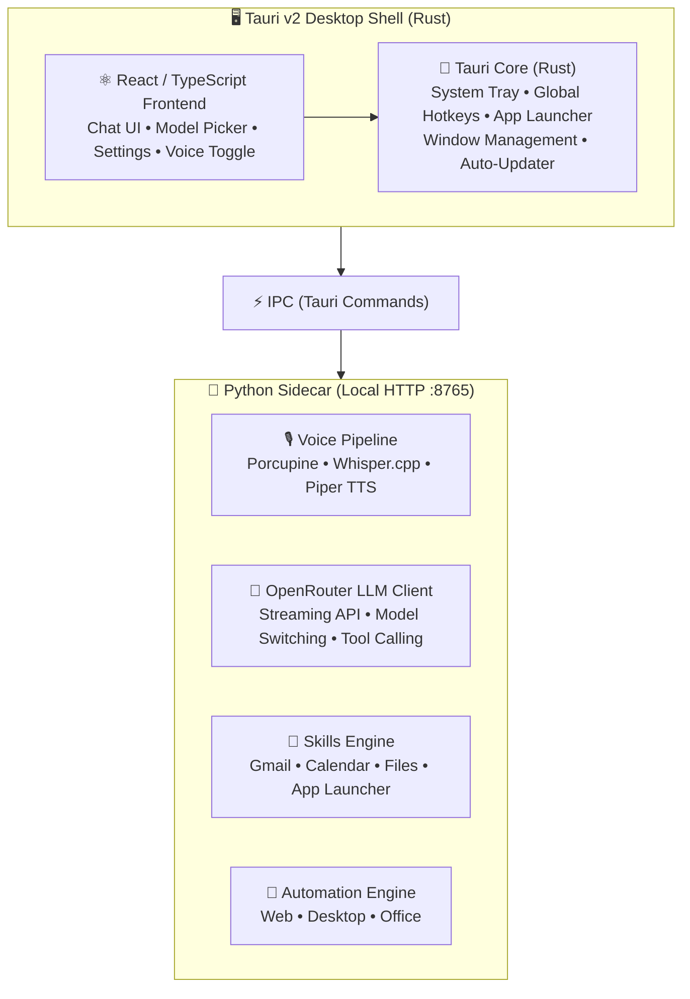
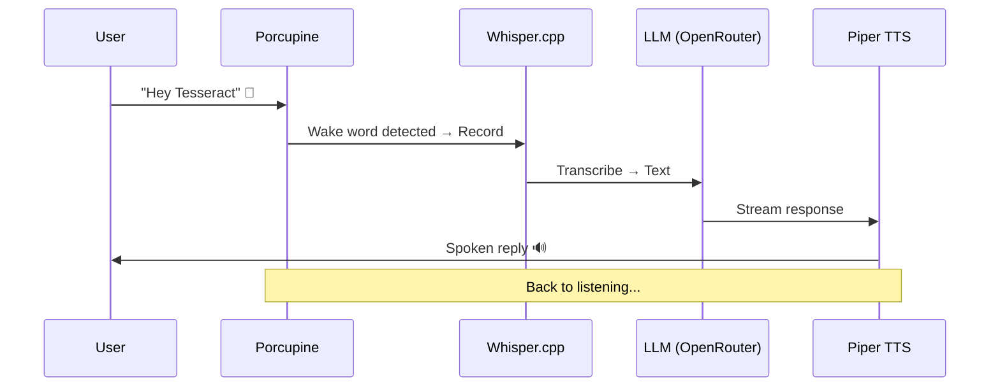
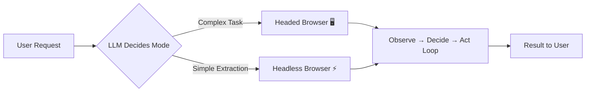
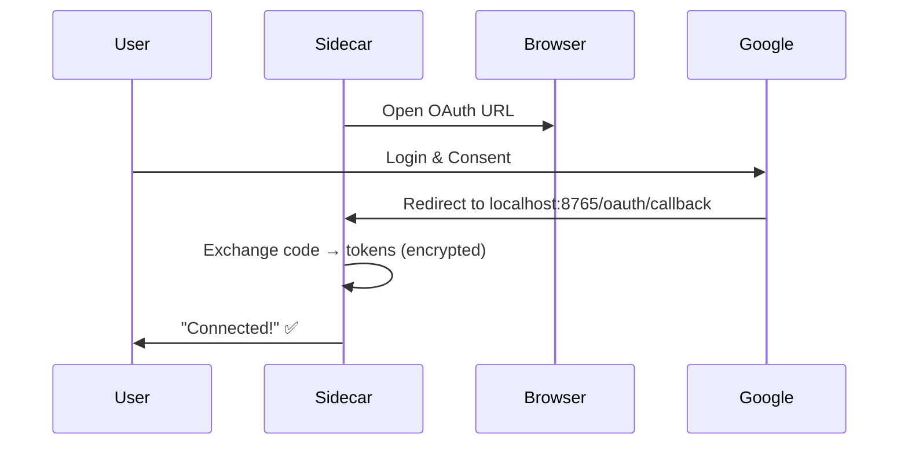

# 🔮 Tesseract AI Agent

<div align="center">


</div>

---

## ✨ Overview

**Tesseract** is a cross-platform (Windows + macOS) AI desktop assistant. It combines a native desktop shell with a Python AI/voice engine, providing **full voice interaction**, **LLM-powered reasoning via OpenRouter**, a **modular skill system**, and **full GUI automation capabilities** — the agent can control websites, desktop apps, and documents like a human would.

### 🎯 Core Philosophy

> **Local-first for privacy and speed, cloud for intelligence.**
>
> All voice processing runs locally; LLM reasoning runs via OpenRouter with user-selectable models.

---

## 🏗️ Architecture

### High-Level Layered Architecture



### Communication Model

| Channel | Protocol | Description |
|---------|----------|-------------|
| **Tauri ↔ Frontend** | Tauri IPC | `@tauri-apps/api` invoke/listen |
| **Tauri ↔ Python** | HTTP + stdio | Sidecar spawned as child, REST on `localhost:8765` |
| **Frontend ↔ Python** | Tauri IPC → HTTP | Commands forwarded through Tauri |

### Cross-Platform Strategy

| Component | Windows | macOS |
|-----------|---------|-------|
| WebView | WebView2 (Win10+) | WKWebView |
| Python Sidecar | PyInstaller `.exe` | PyInstaller `.app` |
| App Launch | `CreateProcess` | `NSWorkspace` |
| Desktop Automation | `pywinauto` / UIA | Accessibility APIs (AX) |
| Installer | `.msi` / `.exe` | `.dmg` / `.app` |

---

## 🎙️ Voice Pipeline



| Stage | Technology | Why |
|-------|-----------|-----|
| **Wake Word** | Porcupine (Picovoice) | Local, low-latency, cross-platform, free tier |
| **Speech-to-Text** | Whisper.cpp | Local, fast (tiny/base), 99+ languages |
| **Text-to-Speech** | Piper TTS / OpenRouter TTS | Local, natural voices; cloud fallback |

### Model Picker & OpenRouter

- **Frontend:** Dropdown fetching models from `/v1/models`
- **Persistence:** Selected model in `~/.tesseract/settings.json`
- **Streaming:** SSE → Python → Tauri IPC → Frontend (real-time)
- **Fallback:** Clear error + retry on OpenRouter unreachable

---

## 🤖 Automation Engine

> **The core differentiating capability** — the ability to **see and interact with apps like a human**.

### Web Automation (Playwright)



| Mode | When Used | Example |
|------|-----------|---------|
| **Headed** 🖥️ | Complex multi-step, visual feedback needed | Raising support ticket, filling forms |
| **Headless** ⚡ | Simple data extraction, API calls | Fetching page, checking status, scraping |

**LLM-Driven Workflow:**
```
User: "Write an email to support about my game ban"
    ↓
1. LLM: needs web browsing → launches Playwright (headed)
2. Navigate to game site → screenshot/DOM to LLM
3. LLM decides: click "Support" → fill form with details
4. Submit → report result
```

**Available Actions:** `navigate` • `click` • `type` • `select` • `extract` • `screenshot` • `wait_for` • `get_page_content`

---

### Desktop GUI Automation

| Layer | Technology | Reliability | Speed |
|-------|-----------|-------------|-------|
| **Primary** 🎯 | OS Accessibility APIs (`pywinauto`/UIA on Win, AX on macOS) | High — reads actual UI elements | Fast |
| **Fallback** 👁️ | PyAutoGUI + Tesseract OCR | Medium — works on any app | Slower |

**Workflow:**
```
User: "Check WhatsApp for new messages"
    ↓
1. Launch WhatsApp via App Launcher
2. Try accessibility tree → parse messages
3. If unavailable → screenshot → OCR → analyze
4. Report new messages
```

**Actions:** `find_window` • `get_ui_elements` • `click` • `type` • `screenshot` • `ocr` • window mgmt

---

### Office Automation

| Task | Primary | Fallback |
|------|---------|----------|
| **Word** 📝 | `python-docx` (no Word needed) | `win32com` (Word app) |
| **Excel** 📊 | `openpyxl` + `pandas` | `win32com` (Excel app) |
| **PowerPoint** 📈 | `python-pptx` | `win32com` |

**Example — Pivot Table from CSV:**
```
User: "Create a pivot table from the CSV in Downloads"
    ↓
1. File System skill → locate CSV
2. pandas → DataFrame
3. openpyxl → new workbook + pivot
4. Save to Desktop → "Created at ~/Desktop/sales_report.xlsx"
```

---

### Automation Orchestration

The LLM receives a **unified toolset** and decides which to use:

```json
{
  "tools": [
    "web_navigate", "web_click", "web_type", "web_extract",
    "web_screenshot", "web_wait", "web_get_content",
    "desktop_find_window", "desktop_get_elements", "desktop_click",
    "desktop_type", "desktop_screenshot", "desktop_ocr",
    "office_read_doc", "office_edit_doc", "excel_create_pivot",
    "file_system.*"
  ]
}
```

---

## 🔌 Skill / Plugin System

### Architecture

```python
class SkillBase(ABC):
    name: str                    # "gmail"
    description: str             # "Send and read Gmail messages"
    schemas: List[ToolSchema]    # JSON schemas for LLM tool calling

    @abstractmethod
    async def execute(self, intent: str, params: dict) -> SkillResult:
        ...
```

### Discovery & Registration

- `skills/` directory scanned at startup
- Each `.py` exporting `SkillBase` subclass → registered
- LLM receives registry as OpenRouter tool definitions
- LLM decides which skill(s) to invoke

### MVP Skills

| Skill | Capabilities | Auth |
|-------|-------------|------|
| **Gmail** 📧 | Read inbox, send, search, draft replies | OAuth 2.0 (Google) |
| **Calendar** 📅 | List events, create, check schedule | OAuth 2.0 (Google) |
| **File System** 📁 | List, read/write, search, file info | Local (sandboxed) |
| **App Launcher** 🚀 | Launch by name, list running, focus | Platform-specific |

### OAuth Flow



- Tokens stored at `~/.tesseract/tokens/` with **AES-256 encryption**
- Refresh token flow for long-lived access

---

## ⚙️ Configuration

### Settings File (`~/.tesseract/settings.json`)

Following the **Claude Code pattern** — UI reads/writes JSON directly via Tauri FS API. No backend API needed.

```json
{
  "env": {
    "OPENROUTER_API_KEY": "sk-or-v1-...",
    "OPENROUTER_BASE_URL": "https://openrouter.ai/api"
  },
  "model": "anthropic/claude-3.5-sonnet",
  "models": {
    "enabled": ["anthropic/claude-3.5-sonnet", "openai/gpt-4o", "meta-llama/llama-3.1-70b-instruct"],
    "favorites": ["anthropic/claude-3.5-sonnet"]
  },
  "voice": {
    "wake_word": "hey tesseract",
    "wake_word_enabled": true,
    "stt_model": "tiny",
    "tts_voice": "default",
    "tts_speed": 1.0
  },
  "automation": {
    "browser_timeout": 30000,
    "headless_default": true,
    "ocr_enabled": false,
    "office_use_com": false
  },
  "skills": {
    "enabled": ["gmail", "calendar", "filesystem", "app_launcher"],
    "mcp_servers": {
      "filesystem": {
        "command": "python",
        "args": ["-m", "mcp_filesystem"],
        "env": { "ALLOWED_PATHS": "/home/user,/workspace" }
      }
    }
  },
  "plugins": {
    "enabled": ["automation", "voice", "browser"],
    "mcp_servers": {
      "browser": {
        "command": "npx",
        "args": ["@anthropic-ai/mcp-playwright"],
        "env": {}
      }
    }
  },
  "theme": "dark",
  "start_on_boot": true,
  "minimize_to_tray": true,
  "global_hotkey": "Ctrl+Alt+P",
  "effort_level": "high",
  "auto_updates": true
}
```

### Settings UI Mapping

| UI Section | Settings Key |
|------------|--------------|
| **API Key** | `env.OPENROUTER_API_KEY` |
| **Model Selection** | `model` + `models.enabled` |
| **Voice Settings** | `voice.*` |
| **Automation Settings** | `automation.*` |
| **Skills & Plugins** | `skills.enabled` + `plugins.enabled` |
| **MCP Servers** | `skills.mcp_servers` + `plugins.mcp_servers` |
| **Theme** | `theme` |
| **Hotkey** | `global_hotkey` |
| **Startup** | `start_on_boot`, `minimize_to_tray` |

---

## 🖥️ User Interface

### Screens

| Screen | Purpose |
|--------|---------|
| **Chat View** 💬 | Main conversation — text input + streaming LLM + voice toggle |
| **Model Picker** 🤖 | Dropdown to switch OpenRouter models |
| **Settings** ⚙️ | Structured UI + direct JSON editor for `settings.json` |
| **Voice Status** 🎙️ | Visual indicator: listening / speaking / idle |
| **Automation Feed** 📺 | Real-time view of agent actions (browser, apps, screenshots) |

### System Tray

- 📍 Icon in system tray (Windows/macOS)
- Right-click: **Show/Hide** • **Settings** • **Quit**
- Left-click: **Toggle window visibility**

### Global Hotkey

| Platform | Default | Configurable |
|----------|---------|--------------|
| Windows | `Ctrl+Alt+P` | ✅ Yes |
| macOS | `Cmd+Opt+P` | ✅ Yes |

---

## 📁 Project Structure

```
Tesseract/
├── src-tauri/                 # 🦀 Tauri Rust Backend
│   ├── src/
│   │   ├── main.rs            # App entry, tray, hotkeys
│   │   ├── commands.rs        # Tauri IPC commands
│   │   ├── sidecar.rs         # Python sidecar lifecycle
│   │   └── platform/          # Windows/macOS specifics
│   ├── Cargo.toml
│   └── tauri.conf.json
├── src/                       # ⚛️ React/TypeScript Frontend
│   ├── App.tsx
│   ├── components/
│   │   ├── ChatView.tsx       # Streaming chat + markdown
│   │   ├── ModelPicker.tsx    # OpenRouter model selector
│   │   ├── SettingsPanel.tsx  # Full settings UI
│   │   └── VoiceIndicator.tsx # Animated voice status
│   ├── hooks/
│   ├── services/
│   │   └── api.ts             # Tauri IPC wrapper
│   └── styles/
├── sidecar/                   # 🐍 Python Sidecar
│   ├── main.py                # Entry, HTTP server
│   ├── server.py              # FastAPI endpoints
│   ├── voice/
│   │   ├── wake_word.py       # Porcupine
│   │   ├── stt.py             # Whisper.cpp
│   │   └── tts.py             # Piper TTS
│   ├── llm/
│   │   └── openrouter.py      # OpenRouter client
│   ├── automation/
│   │   ├── browser.py         # Playwright web automation
│   │   ├── desktop.py         # Desktop GUI (accessibility + OCR)
│   │   ├── office.py          # Word/Excel/PowerPoint
│   │   └── orchestrator.py    # LLM action loop
│   ├── skills/
│   │   ├── __init__.py
│   │   ├── skill_base.py      # Abstract base
│   │   ├── gmail.py
│   │   ├── calendar.py
│   │   ├── filesystem.py
│   │   └── app_launcher.py
│   ├── auth/
│   │   └── google_oauth.py    # OAuth 2.0 flow
│   └── requirements.txt
├── docs/
│   └── specs/
├── package.json
├── tsconfig.json
└── README.md
```

---

## 🚀 Development Workflow

### Prerequisites

- **Rust** (stable) + `cargo`
- **Node.js** 18+ + `npm`
- **Python** 3.11+ + `uv` (recommended) or `pip`
- **Playwright browsers**: `playwright install`

### Quick Start

```bash
# 1️⃣ Clone & enter
git clone https://github.com/Dhrishit04/Tesseract.git
cd Tesseract

# 2️⃣ Python sidecar (terminal 1)
cd sidecar
uv venv
uv pip install -r requirements.txt
playwright install chromium
python main.py
# → Server running on http://localhost:8765

# 3️⃣ Tauri + Frontend (terminal 2)
cd ..
npm install
npm run tauri dev
```

### Environment Variables

```bash
# .env (optional, for sidecar)
OPENROUTER_API_KEY=sk-or-v1-...
OPENROUTER_BASE_URL=https://openrouter.ai/api
PORCUPINE_ACCESS_KEY=your_picovoice_key  # for wake word
```

---

## 📦 Production Build

```bash
# Build Python sidecar (PyInstaller)
cd sidecar
uv pip install pyinstaller
pyinstaller --onefile --name tesseract-sidecar main.py
# → dist/tesseract-sidecar(.exe)

# Build Tauri app
cd ..
npm run tauri build
# → src-tauri/target/release/bundle/
#    ├── msi/ (Windows)
#    ├── dmg/ (macOS)
#    └── appimage/ (Linux, experimental)
```

### CI/CD Pipeline

- ✅ **GitHub Actions** for cross-platform builds
- ✅ **Automated testing** (unit + integration)
- ✅ **Release artifacts** uploaded on tag push
- ✅ **Auto-updater** via Tauri updater

---

## 📚 Dependencies

### Rust (Tauri)
| Crate | Purpose |
|-------|---------|
| `tauri` v2 | Desktop framework |
| `tauri-plugin-shell` | Sidecar management |
| `tauri-plugin-dialog` | File dialogs |
| `tauri-plugin-autostart` | Launch at login |
| `serde` / `serde_json` | Settings serialization |

### Python
| Package | Purpose |
|---------|---------|
| `fastapi` + `uvicorn` | HTTP server |
| `openai` | OpenRouter-compatible SDK |
| `pvporcupine` | Wake word detection |
| `whisper-cpp-python` | Local STT |
| `piper-tts` | Local TTS |
| `google-auth` + `google-api-python-client` | Google APIs |
| `pydantic` | Config/schemas |
| `cryptography` | Token encryption |
| **`playwright`** | Web automation |
| **`pywinauto`** | Windows accessibility |
| **`pyautogui`** | Screen automation |
| **`pytesseract`** | OCR |
| **`pillow`** | Image processing |
| **`python-docx`** | Word automation |
| **`openpyxl`** | Excel automation |
| **`pandas`** | Data processing |
| **`pywin32`** | COM automation (Windows) |

### Frontend
| Package | Purpose |
|---------|---------|
| `React 18` + `TypeScript` | UI framework |
| `@tauri-apps/api` v2 | Tauri IPC |
| `Tailwind CSS` | Styling |
| `react-markdown` | LLM response rendering |
| `lucide-react` | Icons |

---

## ✅ Success Criteria (MVP)

- [x] Type message → LLM response via OpenRouter
- [x] Switch between OpenRouter models
- [x] Voice: wake word → STT → LLM → TTS loop
- [x] Gmail: read inbox, send email
- [x] Calendar: check schedule, create events
- [x] File System: browse, read, search
- [x] App Launcher: open apps by voice/text
- [x] **Web Automation: navigate, find info, fill forms, submit**
- [ ] **Desktop GUI: interact via accessibility APIs**
- [ ] **Office: create Excel pivots, edit Word docs**
- [ ] **WhatsApp: read messages from WhatsApp Desktop**
- [x] Cross-platform: Windows + macOS
- [x] System tray: minimize, right-click menu
- [x] Global hotkey: toggle window

---

## 🚧 Roadmap

### Phase 1: Core ✅
- [x] Tauri + React shell
- [x] OpenRouter integration
- [x] Settings persistence

### Phase 2: Voice ✅
- [x] Porcupine wake word
- [x] Whisper.cpp STT
- [x] Piper TTS
- [x] OpenRouter TTS fallback

### Phase 3: Skills ✅
- [x] Skill base architecture
- [x] Gmail + Calendar (OAuth)
- [x] File System + App Launcher

### Phase 4: Automation 🔄
- [x] **Web Automation (Playwright)**
- [ ] Desktop GUI Automation
- [ ] Office Automation

### Phase 5: Polish
- [ ] Automation Feed UI
- [ ] MCP Server integration
- [ ] Plugin marketplace
- [ ] Performance optimization

---

## 🤝 Contributing

```bash
# 1. Fork & clone
# 2. Create feature branch
git checkout -b feat/amazing-feature

# 3. Make changes + test
# 4. Commit with conventional commits
git commit -m "feat: add amazing feature"

# 5. Push & open PR
git push origin feat/amazing-feature
```

### Code Style
- **Rust:** `cargo fmt` + `cargo clippy`
- **Python:** `ruff format` + `ruff check`
- **TypeScript:** `eslint` + `prettier`

---

## 📄 License

**MIT License** — see [LICENSE](LICENSE) for details.

---

## 🙏 Acknowledgments

- [Tauri](https://tauri.app/) — Amazing desktop framework
- [OpenRouter](https://openrouter.ai/) — Unified LLM API
- [Picovoice](https://picovoice.ai/) — Porcupine wake word
- [Whisper.cpp](https://github.com/ggerganov/whisper.cpp) — Local STT
- [Piper TTS](https://github.com/rhasspy/piper) — Local TTS
- [Playwright](https://playwright.dev/) — Web automation
- [All open-source contributors](https://github.com/Dhrishit04/Tesseract/graphs/contributors) ❤️

---

<div align="center">

**Made with 💜 by the Tesseract Team**

[🐛 Report Bug](https://github.com/Dhrishit04/Tesseract/issues) • [💡 Request Feature](https://github.com/Dhrishit04/Tesseract/issues/new) • [📖 Docs](https://github.com/Dhrishit04/Tesseract/wiki)

</div>

---

<details>
<summary><b>📸 Screenshots (Coming Soon)</b></summary>

| Chat View | Settings | Voice Indicator |
|-----------|----------|-----------------|
|  |  |  |

</details>

<details>
<summary><b>🎬 Demo Videos (Coming Soon)</b></summary>

- [Voice Interaction Demo](#)
- [Web Automation Demo](#)
- [Desktop Automation Demo](#)
- [Office Automation Demo](#)

</details>