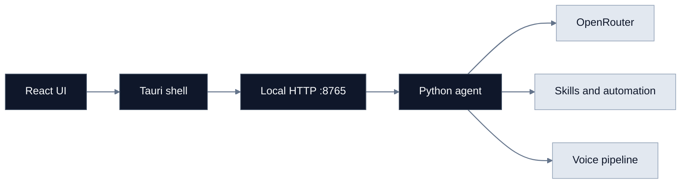
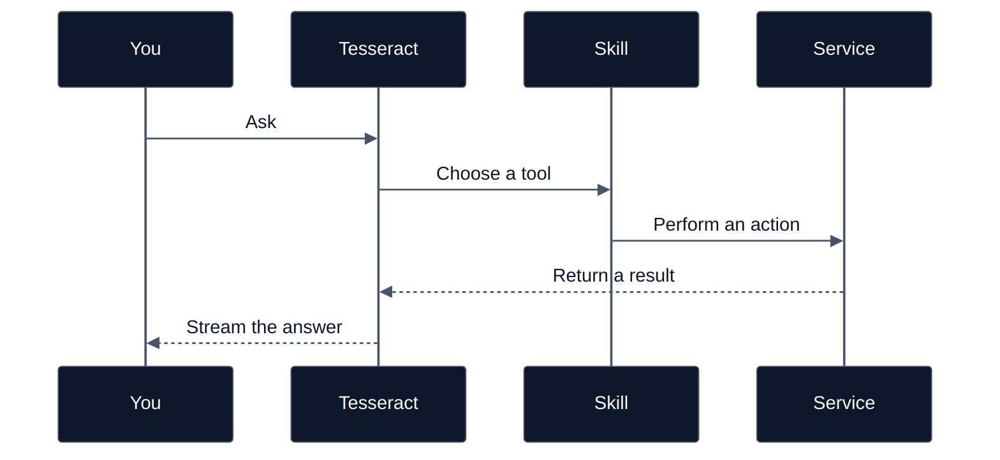

# Tesseract

A local-first desktop assistant with a Tauri shell, React interface, Python sidecar, OpenRouter chat, skills, voice support, and automation tools.

> Keep the interface quiet. Let the agent do the busy work.


## Architecture



The app is split into three small layers:

- `src/` contains the React and TypeScript interface.
- `src-tauri/` contains the native shell, tray, settings, and sidecar lifecycle.
- `sidecar/` contains FastAPI, LLM access, skills, voice, and automation.

## Current capabilities

- Streaming and non-streaming OpenRouter chat with tool calls
- Model picker with local settings persistence
- Filesystem and application-launcher skills
- Gmail and Google Calendar integrations through OAuth
- DOCX, XLSX, pivot-table, and PPTX automation
- Playwright web automation
- Windows desktop automation with accessibility and OCR paths
- Optional wake-word, Whisper STT, and Piper TTS support
- Windows MSI and NSIS production bundles



## Quick start

### Requirements

- Node.js 18+
- Rust stable
- Python 3.11+
- `uv` or `pip`
- WebView2 on Windows

### Frontend

```powershell
npm install
npm run dev
```

### Sidecar

```powershell
cd sidecar
uv venv
uv pip install -r requirements.txt
$env:PYTHONPATH = "$PWD"
.\.venv\Scripts\python.exe main.py
```

The sidecar listens on `http://127.0.0.1:8765`.

Optional groups are defined in `sidecar/pyproject.toml`:

```powershell
uv pip install -e ".[google,automation]"
uv pip install -e ".[voice]"
playwright install chromium
```

Voice installation may require a C++ toolchain on Windows and a Picovoice access key.

## Development checks

Run from the repository root:

```powershell
$env:PYTHONPATH = "$PWD\sidecar"
.\sidecar\.venv\Scripts\python.exe -m unittest discover -s sidecar/tests -p "test_*.py"
.\sidecar\.venv\Scripts\python.exe -m compileall -q sidecar
npm run build
cargo check --manifest-path src-tauri/Cargo.toml
```

## Packaging

Build the Python sidecar first. The script uses `sidecar/.venv` when available and produces the target-triple executable expected by Tauri.

```powershell
.\sidecar\build.ps1
npm run tauri build
```

Installers are written to `src-tauri/target/release/bundle/`.

## Configuration

Settings are stored at:

```text
~/.tesseract/settings.json
```

The sidecar exposes health, chat, skills, voice, automation, and OAuth routes. FastAPI documentation is available at `/docs` while the sidecar is running.

## Project map

```text
Tesseract/
├── src/                 React interface
├── src-tauri/           Tauri and Rust commands
├── sidecar/             Python agent
│   ├── auth/            Google OAuth
│   ├── automation/      Web, desktop, and Office tools
│   ├── skills/          Discoverable agent skills
│   └── voice/           Wake word, STT, and TTS
├── docs/                Plans and specifications
└── package.json
```

## Roadmap

The next product surfaces are the automation feed, cancellation for long-running actions, stronger cross-platform desktop support, voice model packaging, and broader end-to-end coverage.

## License

MIT. See [LICENSE](LICENSE) when it is added to the distribution.
